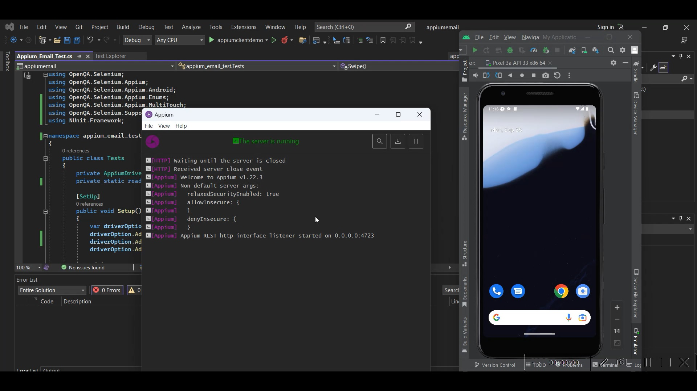

# Appium

### Task

- Setup Android SDK
- Configure system variables
- Download an Android emulator or configure your own mobile
- Connect to device/emulator via *uiautomatorviewer*
- Create a test for Gmail (web or native)  

Video of working test can be found here: https://drive.google.com/file/d/1zGG725PK_JMXgIgLuvHiPZnbDocAak9o/view?usp=sharing
